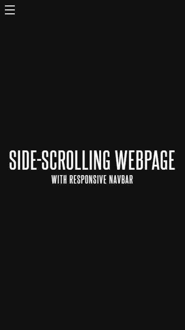
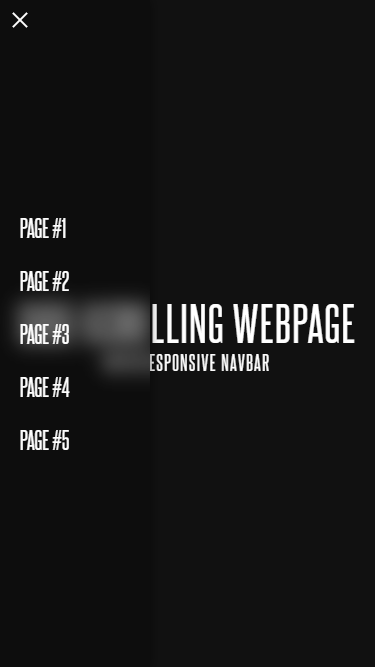

# Responsive Side-scrolling Webpage (with Navbar)

For demonstration purposes, I've decided to create a responsive, horizontally-scrolling webpage complete with a vertical, responsive navbar. Said navbar also has an opening and closing menu on mobile screens (at a width of no more than 576 pixels). I will also be breaking down how this was accomplished so you, dear reader, can do something similar in your own projects.

## Table of Contents

- [Overview](#overview)
  - [Screenshots](#screenshots)
  - [Links](#links)
- [How I did it](#how-i-did-it)
  - [The HTML](#the-html)
    - [Navbar](#navbar)
    - [Page content](#page-content)
  - [The CSS](#the-css)
    - [Priming the page](#priming-the-page)
    - [Styling the navbar](#styling-the-navbar)
    - [The main window](#the-main-window)
  - [The JavaScript](#the-javascript)
- [Author](#author)
- [Acknowledgements](#acknowledgements)

## Screenshots

### Desktop


### Mobile (Menu Closed)



### Mobile (Menu Open)



## How I did it

Thankfully, the layout and menu is pretty simple to accomplish, as all that's required is some HTML, CSS, and JavaScript all laid out in their proper places.

### The HTML

#### Navbar:

```html <!-- Outermost navbar shell -->
<nav class="navbar">
  <!-- Encases all the navbar's parts -->
  <nav class="nav-wrapper">
    <!-- Main label for menu toggler; toggles the checkbox -->
    <label for="menu-btn-toggler" class="menu-btn">
      <!-- Hamburger menu, styled in CSS -->
      <span class="menu-btn-burger"></span>
    </label>

    <!-- Toggles menu on mobile; make sure it's a checkbox! -->
    <input class="menu-btn-checkbox" id="menu-btn-toggler" type="checkbox" />

    <!-- Inner wrapper for links; THIS is your actual navbar -->
    <nav class="links-wrapper">
      <!-- Each link will take you to a section on the page -->
      <a href="#page-1" class="nav-link">Page #1</a>
      <a href="#page-2" class="nav-link">Page #2</a>
      <a href="#page-3" class="nav-link">Page #3</a>
      <a href="#page-4" class="nav-link">Page #4</a>
      <a href="#page-5" class="nav-link">Page #5</a>
    </nav>
    <nav></nav>
  </nav>
</nav>
```

**NOTE**: when setting up your checkbox `<input>`, **make sure** its `<label>` is for its `id`, otherwise it won't toggle the checkbox properly.

#### Page Content:

```html
<!-- The Outer Wrapper; this serves as our "window" for the page. -->
<div class="outer-wrapper">
  <!-- The actual bulk of the page, which holds all of our sections -->
  <div class="page-content">
    <!-- Each section is a "page" within the content bulk -->
    <section class="page-1" id="page-1">
      <h1>Side-scrolling webpage</h1>
      <h2>with responsive navbar</h2>
    </section>
    <section class="page-2" id="page-2">
      <h1>Page Two</h1>
    </section>
    <section class="page-3" id="page-3">
      <h1>Page Three</h1>
    </section>
    <section class="page-4" id="page-4">
      <h1>Page Four</h1>
    </section>
    <section class="page-5" id="page-5">
      <h1>Page Five</h1>
    </section>
  </div>
</div>
```

Pay close attention to the `<div>` elements with the `"outer-wrapper"` and `"page-content"` classes. As indicated in the markup breakdown, the `"outer-wrapper"` div serves as our window, though which we'll be viewing our `"page-content"`, which is self-explanatory.

Meanwhile, each `<section>` serves as an individual slice of content on the page. If you wanted to, you could just as easily make a single-page application using this process, but we're just focused on laying it all out for now.

### The CSS

#### Priming the page:

```css
* {
  box-sizing: border-box;
  margin: 0;
  padding: 0;
}
```

#### Styling the navbar:

```css

/* The main navbar element */
.navbar {
  height: 100vh;
  left: 0;
  position: fixed;
  top: 0;
  width: 150px;
  z-index: 5000;
}

/* Keeps everything to scale */
.nav-wrapper {
  height: 100%;
  width: 100%;
}

/* Our links wrapper */
.links-wrapper {
  align-items: flex-start;
  backdrop-filter: blur(10px);
  background-color: rgba(0, 0, 0, 0.25);
  display: flex;
  flex-direction: column;
  height: 100%;
  justify-content: center;
  left: -100%;
  position: absolute;
  top: 0;
  transition: all 0.2s ease-in-out;
  width: 100%;
}

/* Each nav link */
.nav-link {
  color: #fff;
  display: block;
  font-family: "Steelfish", sans-serif;
  font-size: 1.5rem;
  padding: 0.75rem 1.25rem;
  text-decoration: none;
  text-transform: uppercase;
  width: 100%;
}

/* Hovering over them */
.nav-link:hover {
  background-color: rgba(0, 0, 0, 0.5);
}

/* And now our media query; activates at or above 576 pixels */
@media screen and (min-width: 576px) {
  .navbar {
    left: 0;
  }

  .links-wrapper {
    box-shadow: 0 0 10px rgba(0, 0, 0, 0.5);
    left: 0;
  }
}
```

You might notice the positioning of the menu on mobile is set to be 100% offscreen. This is normal, since we're now going to invoke our checkbox hack:

```css

/* Houses and centers the hamburger menu icon with Flexbox: */
.menu-btn {
  align-items: center;
  cursor: pointer;
  display: flex;
  height: 40px;
  justify-content: center;
  left: 0;
  position: absolute;
  top: 0;
  width: 40px;
  z-index: 5;
}

/* Starts the menu icon, specifically the center line... */
.menu-btn-burger {
  background-color: white;
  display: block;
  height: 2px;
  width: 20px;
}

/* ...sets up the upper and lower hamburger menu lines... */
.menu-btn-burger::before, .menu-btn-burger::after {
  background-color: #fff;
  content: "";
  display: block;
  height: 2px;
  position: absolute;
  transition: all 0.25s ease-in-out;
  width: 20px;
}

/* ...and finally distributes them, top and bottom. */
.menu-btn-burger::before {
  transform: translateY(-8px);
}

.menu-btn-burger::after {
  transform: translateY(8px);
}

/* Distributes and hides the checkbox for the checkbox hack: */
.menu-btn-checkbox {
  left: 0;
  position: fixed;
  top: 0;
  visibility: hidden;
}

/* On mobile, when the checkbox is checked, causes the nav menu to appear, and even adds a nifty little shadow for styling purposes: */
.menu-btn-checkbox:checked ~ .links-wrapper {
  box-shadow: 0 0 10px rgba(0, 0, 0, 0.5);
  left: 0;
}

/* Hides the hamburger menu icon on larger than mobile screens: */
@media screen and (min-width: 576px) {
  .menu-btn {
    display: none;
  }
}

/* When our menu button gets the .open class slapped onto it by JavaScript, then our hamburger menu collapses into a nice little X. */
.menu-btn.open .menu-btn-burger {
  background-color: transparent;
}

.menu-btn.open .menu-btn-burger::before {
  transform: rotate(45deg);
}

.menu-btn.open .menu-btn-burger::after {
  transform: rotate(-45deg);
}
```

#### The main window:

```css
/* Sets the main window on mobile */
.outer-wrapper {
  overflow-y: hidden;
  scroll-behavior: smooth;
  scroll-snap-type: x mandatory;
}

/* Sets the size of the main content block */
.page-content {
  display: flex;
  flex-direction: row;
  width: 500vw; /* 5 100vw-sized sections = 500vw */
}

/* Media query for larger than mobile screen sizes */
@media screen and (min-width: 576px) {

    /* Sets the outer wrapper to be the size of the user's screen, */
    /* rotates and moves it into place, and hides overflow, and */
    /* sets its scroll to snap if its close enough a section's edge: */
    .outer-wrapper {
        height: 100vw;
        width: 100vh;
        transform: rotate(-90deg) translateX(-100vh);
        transform-origin: top left;
        overflow-y: overlay;
        overflow-x: hidden;
        position: absolute;
        scroll-snap-type: y proximity;
    }

    /* Rotates the page's content block into place */
    .page-content {
        transform: rotate(90deg) translateY(-100vh);
        transform-origin: top left;
    }
}

/* Sets each section to be the width and height of the user's screen */
section {
  align-items: center;
  display: flex;
  flex-direction: column;
  height: 100vh;
  justify-content: center;
  scroll-snap-align: start;
  width: 100vw;
}

section h1 {
  font-size: 5rem;
}

/* Each page now has its own color: */
.page-1 {
  background-color: #111;
}

.page-2 {
  background-color: #1a1111;
}

.page-3 {
  background-color: #111a11;
}

.page-4 {
  background-color: #11111a;
}

.page-5 {
  background-color: #1a1a11;
}
```

### The JavaScript

And now, the JavaScript. There's not much there, but it's still important anyway:

```javascript
// DOM Queries
const checkBox = document.querySelector(".menu-btn-checkbox")
const menuBtn = document.querySelector(".menu-btn")
const navLinks = document.querySelectorAll(".nav-link")

// When a user clicks the menu button on mobile, toggle the "open" class:
menuBtn.addEventListener("click", () => {
    menuBtn.classList.toggle("open")
})

// For each nav link, add a click event listener, and if someone clicks it, set up a variable for the screen's width, then if it's less than or equal to 576 pixels, set the menu's checkbox to "false", then toggle the menu button's "open" class off:
navLinks.forEach(link => {
  link.addEventListener("click", () => {
    const screenWidth = window.innerWidth

    if (screenWidth <= 576) {
      checkBox.checked = false
      menuBtn.classList.toggle("open")
    }
  })
})
```

## Author

Valkinsenn, who else? :P

## Acknowledgements

- Kevin Powell | Without this man's [tutelage in CSS wizardry](https://scrimba.com/learn/responsive), I wouldn't know even a fraction of what I do now.
- Red Stapler | His [video](https://www.youtube.com/watch?v=OKIszrFBQ2M) on horizontal websites helped me a bunch.
- The Net Ninja | He's got a [ton of material](https://www.youtube.com/channel/UCW5YeuERMmlnqo4oq8vwUpg) about JavaScript and web development topics in general, frontend *and* backend.
- Google | A web designer / developer's best friend. [Seriously](https://www.google.com).